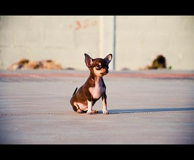
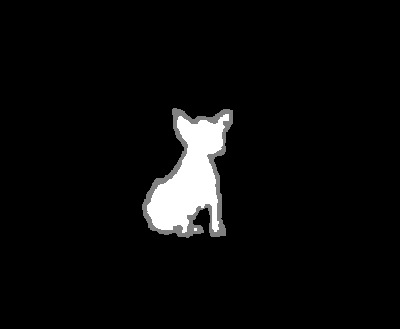

# Background separation in images


## Table of contents
- [Introduction](#introduction)
- [Installation & usage](#installation/usage)
- [Technical explanation](#Explanation)
- [Next steps](#Next)
- [Acknowledgment](#Acknowledgment)


## 1. Introduction

In this group project we explore AI image processing techniques for **separating the subject from the background in images**, also known as **alpha matting**. The goal is to build on existing models and methods to get very **accurate** results.

This project is a collaboration between [Bram](https://github.com/), [Martin](https://github.com/), [Philippe](https://github.com/), and is part of a training in collaboration with [Faktion](https://www.faktion.be/). It was completed in two weeks.

We use the **trimap** approach, in which the alpha channel is generated in two separate steps.

1. First, a ***trimap*** is generated. This is a 3-channel image that segmentates the original image into
    * the background (black);
    * the foreground (white);
    * the edge zone where the next model should do its thing (gray).
2. From this trimap, the FBA-Matting algorithm generates the final alpha channel.

| Original image                        | Trimap                                     | Alpha channel |
| ------------------------------------- | ------------------------------------------ | ------------- |
|  |  |               |


## 2. Installation & usage

You'll need _Tensorflow_ for the trimap model, and _PyTorch_ for the alphamatte. With a new virtual environment, **installing** the dependencies from _requirements.txt_ should be enough.

```sh
# create venv
python3 -m venv alphavenv
source alphavenv/bin/activate

# install deps
pip install -r requirements.txt
```
To generate a trimap image, you can **run**

```sh
python generate_trimaps.py path/to/image.jpg
```

which will generate a trimap image next to this file. 

**TODO**


## 3. Technical explanation

### About the training data

We use the **[DUTS dataset](http://saliencydetection.net/duts/)** for training our models. It consists of 10553 training images and 5019 test images, all with manually cut-out alpha masks. The images are all fairly small and contain a lot of different subjects.

We created two **wrapper classes** in _[duts.py](duts.py)_ for easy working with the structure of this data. It has a class `DutsDataset` that scans a folder for the dataset, and downloads/extracts it if it is not available. There is also a class `DutsImage` that has the correct methods for retireving the mask/image, plotting with orr without alpha matte and so on. More info is available in the docstrings of this file.

### Trimap generation

For automatically generating a trimap from a provided image, a model has to be trained. We opted to **directly** generate the trimap in one **Pix2Pix model**.

The model is a fresh [U-Net ](https://lmb.informatik.uni-freiburg.de/people/ronneber/u-net/) model, based on the pretrained MobileNetV2. 

### Alphamatting

We use the ***FBA Matting approach*** ([FBA_Matting](https://github.com/spmallick/learnopencv/tree/master/FBAMatting)) to generate the ***alapha matte***. The FBA Matting algorithm takes as input, a ***trimap*** generated by the previous step and outputs an ***alpha channel***. The algorithm uses an encoder with ***ResNet-50*** architecture and an ***fba_decoder***.


## 4. Next steps

 ***to do***

## 5. Acknowledgement

- [FBA_Matting](https://github.com/spmallick/learnopencv/tree/master/FBAMatting)
